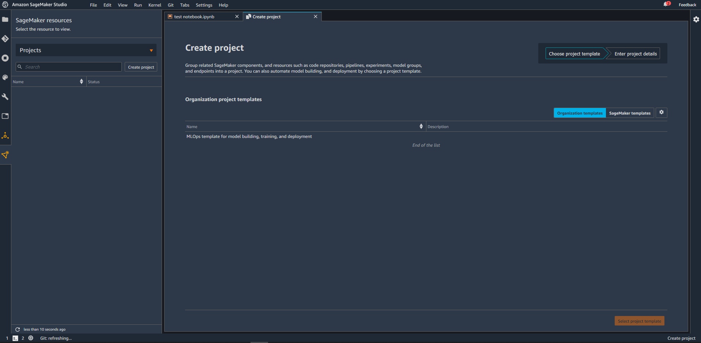
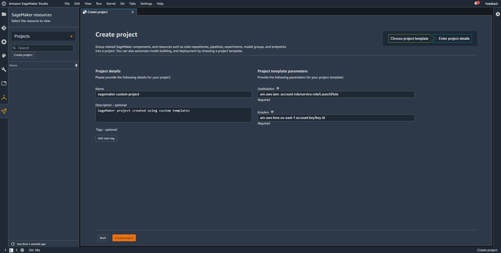

## Template Description

The sample template `MLOps-template-example.yml` was created using the first-party MLOps template for model building, training and deployment. The template is updated to have security best practices, i.e., encryption and versioning for S3 buckets. The template also requires the user to provide a customer managed key on KMS for bucket encryption, and uses custom roles as launch constraints for deploying the template with least-privilege permissions.

Refer to the repo's `README` file for general instructions. A high-level list is shown below. 

## Creating custom template
1. Create a Service Catalog Portfolio
2. Create a Service Catalog Product using the attached `MLOps-template-example.yml` file.
3. Add Launch Constraint

    The sample uses two roles - one for launching the product (set as Launch constraint), and the second for use by services Policy statements for the launch and product use roles are provided in the `policies` folder.
    - Create a customer managed KMS key at https://console.aws.amazon.com/kms
    - Update the policy statements in `policies/` with the right ARNs before deploying (Line 7 in both policy statements).
    - Create IAM policies and roles for both ServiceCatalogLaunch and ServiceCatalogUse roles.

4. Making the product available in SageMaker Studio by adding the role and tags.

## Creating the project
- Open SageMaker Studio and sign in to your user profile.
- Choose the SageMaker components and registries icon on the left, and choose Create project button.
- Switch to the Organization templates tab. The default view displays SageMaker templates.
- The template you created will be displayed in the screen. (If you do not see it yet, make sure the execution role is added to the product and the sagemaker:studio-visibility tag is added exactly as described above).
- Choose the template and click Select project template.

- Enter a name and optional description for the project. The custom template requires that the project name start with 'sagemaker'. For example, add "sagemaker-custom-project" as the Project Name. Add the UseRoleArn (launch constraint role created in Step 3) and the KMS ARN. Optionally, add tags and choose Create project.

Your project is now created and loaded with sample seed code for training and deploying a model for the abalone dataset!

### Appendix: Resources created

The SageMaker project creates the following AWS resources:
- S3 Bucket to store artifacts
- CodePipeline workflow for model building, including - 
    - CodeCommit repository
    - CodeBuild project to execute a SageMaker pipeline
- CodePipeline workflow for model deployment, including
    - CodeCommit repository
    - CodeBuild project to create configuration files for deployment
    - CodeBuild projects to deploy Staging and Prod resources through CloudFormation
    - Test Staging endpoint
    - Manual approval step from Staging to Prod
- EventBridge rules to trigger the pipelines

In addition, the seed code provided creates the following set up within the Project:
- Two repositories for model building and deployment
- A fully executable SageMaker pipeline with code and a sample Jupyter notebook
- Model package groups in SageMaker Model Registry, associated with this project
- Staging endpoint once the pipeline executes successfully. 
_Note: On project creation, the pipeline will automatically execute._
